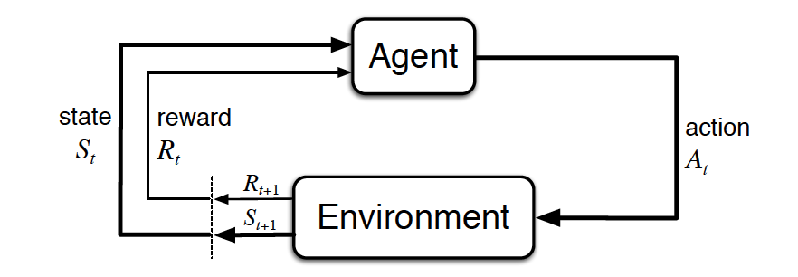
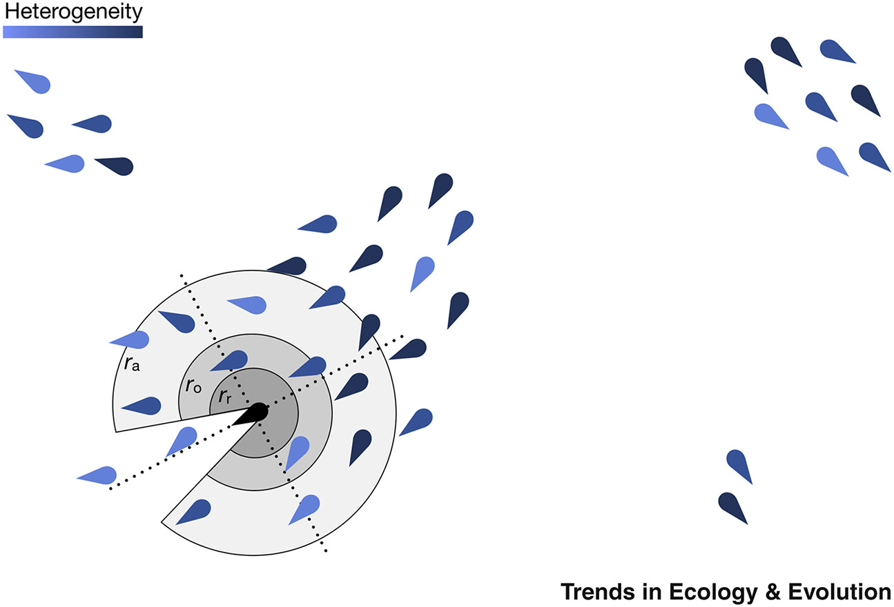

# Outline

-   Reinforcement Learning

-   Network

-   Simulating Multi-agent Reinforcement Learning

# Reinforcement Learning

<br> Reinforcement learning concerns a family of problems in which an
agent evolves while analyzing consequences of its actions, based on a
simple scalar signal (the reinforcement) derived from the environment.
The purpose of reinforcement learning is for the agent to learn an
optimal (or near-optimal) policy that maximizes the reward function or
other user-provided reinforcement signal that accumulates from immediate
rewards. <br>

<br>



<br>

1 - at time step *t*, the agent is in state $S_{t}$,

2 - agent chooses one of the possible actions in this state, $A_{t}$,

3 - agent applies the action, what provokes,:

-   the passage to a new state, $S_{t+1}$,

-   the receipt of the reinforcement, $R_{t}$;

4 - *t* \<- *t + 1*

5 - go to 2 or stop if the new state is a terminal one.

<br>

**Two most important distinguishing features of reinforcement
learning:**

-   Trial-and-error search

-   Delayed reward

<br>

### k-armed bandit problem

<br>


::::: {style="display: flex;"}
<div>


```
## Error in fluidPage(sidebarLayout(sidebarPanel(sliderInput("mean_adjust", : could not find function "fluidPage"
```

```
## Error in shinyApp(ui = ui, server = server, options = list(height = 800, : could not find function "shinyApp"
```

</div>

<div>


```
## Error in fluidPage(sidebarLayout(sidebarPanel(sliderInput("mean_adjust", : could not find function "fluidPage"
```

```
## Error in shinyApp(ui = ui, server = server, options = list(height = 800, : could not find function "shinyApp"
```

</div>
:::::

<br> <br>

In reinforcement learning, learning is essentially the evaluation of
actions (not from correct instructions).

### Model-free reinforcement learning: Q-learning

Q-learning is based on the Temporal Differences and used to determine an
optimal policy. It doesn't require the knowledge of probability
transitions from a state to another and is model-free. <br> <br> **Value
function: Rescorla-Wagner rule** <br> <br> $$
Q_{a,t+1 }\leftarrow (1-\alpha)Q_{a,t } + \alpha\pi_{a,t}
$$

<br> $\alpha$ learning rate

$Q_{a,t}$ current value

$\pi_{a,t}$ prediction error <br>

<br>

**Choice Probability function**

Asocial:softmax function

Social: frequency-dependent strategy <br> $$
P_{a,t+1 } = (1-\sigma)\frac{exp(\beta Q_{a,t})}{\sum exp(\beta Q_{k,t})}+\sigma\frac{N_{a,t}^\theta}{\sum N_{k,t}^\theta}
$$ <br> $\beta$ inverse temperature: stochasticity of
action(exploration-exploitation tendency)

$\sigma$ copying weight

$\theta$ conformity bias(strength of conformity)

# Network

<br>

<br>



<br>

<br>

## Using network to represent diverse social interactions

**Full graph**


```r
g <- make_full_graph(40)
plot(g, vertex.size=6, vertex.label=NA)
```


**Tree graph**


```r
treeg <- make_tree(50, children = 8, mode = "undirected")

plot(treeg, vertex.size=6, vertex.label=NA) 
```


**Star graph**


```r
star <- make_star(40)
plot(star, vertex.size=6, vertex.label=NA) 
```


**Erdos-Renyi random graph** $G(n,p)$


```r
#$G(n,p)$ graph
gnp <- sample_gnp(n=100, p=.005)
sphere <- layout_(gnp, on_sphere())
plot(gnp, vertex.size=6, vertex.label=NA, layout = sphere)
```


<br> <br>

::::: {style="display: flex;"}
<div>


```
## Error in fluidPage(actionButton("update", "Give me a Randim Graph!"), : could not find function "fluidPage"
```

```
## Error in shinyApp(ui = ui, server = server, options = list(height = 500, : could not find function "shinyApp"
```

</div>

<div>


```
## Error in fluidPage(actionButton("update", "Rewire!"), plotOutput("rewirep", : could not find function "fluidPage"
```

```
## Error in shinyApp(ui = ui, server = server, options = list(height = 500, : could not find function "shinyApp"
```

</div>
:::::

<br> <br>

## Simulating Multi-agent Reinforcement Learning

### Network setup

Let's use the simple Erdos-Renyi random graph $G(n,p)$ as a
demonstration.

**Erdos-Renyi random graph** $G(n,p)$

Get the adjacency matrix for later social frequency calculation


```r
# generate a G(n,p) graph
gnp <- sample_gnp(n = 10, p = .5)

# adjacency matrix
gnp_adjMatrix <- get.adjacency(
  gnp,
  type = c("both"),
)
gnp_adjMatrix 
```

```
## 10 x 10 sparse Matrix of class "dgCMatrix"
##                          
##  [1,] . . . 1 . . 1 . . 1
##  [2,] . . 1 . . . 1 . 1 .
##  [3,] . 1 . 1 . 1 1 1 . 1
##  [4,] 1 . 1 . 1 . 1 . . .
##  [5,] . . . 1 . . 1 . 1 .
##  [6,] . . 1 . . . 1 . 1 1
##  [7,] 1 1 1 1 1 1 . . . .
##  [8,] . . 1 . . . . . . 1
##  [9,] . 1 . . 1 1 . . . 1
## [10,] 1 . 1 . . 1 . 1 1 .
```

```r
plot(gnp, vertex.size=6, vertex.label=NA, layout = layout.sphere)
```


### Global setup


```r
# Session Setup
set.seed(6) 
group_size = 10 
repetition = 10 # number of repetition for a specific combination of parameters
horizon = 100 # total steps of one session


# Bandit Setup
num_options = 2 # the number of arms
mean_list = c(4, 5) 
sd_list = c(1, 1)


# RL parameter space
Q_initial = 4.5 # prior belief
alpha_list <- c(0.3, 0.5, 0.7)
beta_list <- c(2, 4, 6)
sigma_list <- seq(0, 1, 0.2)
theta_list <- seq(1, 7, 2)
```

<br> **Container ready for data recording**


```r
social_learning_model_data <- 
  data.frame(
    
    beta = rep(beta_list, times = 1, each = length(alpha_list)*length(sigma_list)*length(theta_list)*repetition*horizon)
    , alpha = rep(alpha_list, times = length(beta_list), each = length(sigma_list)*length(theta_list)*repetition*horizon)
    , sigma = rep(sigma_list, times = length(beta_list)*length(alpha_list), each = length(theta_list)*repetition*horizon)               
    , theta = rep(theta_list, times = length(beta_list)*length(alpha_list)*length(sigma_list), each = repetition*horizon)               
    , r = rep(1:repetition, times = length(beta_list)*length(alpha_list)*length(sigma_list)*length(theta_list), each = horizon)
    , t = rep(1:horizon, times = length(beta_list)*length(alpha_list)*length(sigma_list)*length(theta_list), each = 1)
    , bestChoiceProb = rep(NA, length(beta_list)*length(alpha_list)*length(sigma_list)*length(theta_list)*repetition*horizon)
    , averageReward = rep(NA, length(beta_list)*length(alpha_list)*length(sigma_list)*length(theta_list)*repetition*horizon)
  )
```

<br> **Individual differences**

Noise add to learning parameters.Later parameter recovery test.

Fix $\alpha$ to 0.3 <br>


```r
 # Setting individual learning parameters
      alpha_base <- convert_prob_to_base(alpha)
      this_alpha <- (alpha_base + rnorm(group_size, 0, 0.05)) %>% convert_base_to_prob
      this_beta <- beta + rnorm(group_size, 0, 0.05)
```


```
##  [1] 0.3028385 0.2934271 0.3091994 0.3184426 0.3002540 0.3038784 0.2864358 0.3078123 0.3004714 0.2891085
```

<br>

Fix $\beta$ to 6 <br>


```r
      this_beta <- beta + rnorm(group_size, 0, 0.05)
```


```
##  [1] 6.086393 5.941070 6.032660 5.981572 5.970022 6.002730 6.085384 5.945281 5.985536 6.110371
```

<br>

### Matrix setup

**Value matrix**

Setup initial Q value


```r
      Q <- array(dim = c(num_options, horizon, group_size))
      Q[,1,] <- Q_initial # Q_initial = 4.5
```


```
##      [,1] [,2] [,3] [,4] [,5] [,6] [,7] [,8] [,9] [,10]
## [1,]  4.5   NA   NA   NA   NA   NA   NA   NA   NA    NA
## [2,]  4.5   NA   NA   NA   NA   NA   NA   NA   NA    NA
```

<br> **Global action probability matrix**

Setup initial p


```r
netChoiceProb <- array(dim = c(num_options, horizon, group_size))
netChoiceProb[,1,] <- 1/num_options
```


```
##      [,1] [,2] [,3] [,4] [,5] [,6] [,7] [,8] [,9] [,10]
## [1,]  0.5   NA   NA   NA   NA   NA   NA   NA   NA    NA
## [2,]  0.5   NA   NA   NA   NA   NA   NA   NA   NA    NA
```

<br> **Action, reward and action probability matrices**


```r
choices <- matrix(nrow=group_size, ncol=horizon)
payoffs <- matrix(nrow=group_size, ncol=horizon)
bestChoiceProb <- matrix(nrow=group_size, ncol=horizon)
```

<br> **Social frequency matrix**


```r
# social frequency matrix to track available social information in the environment
      socialFrequency = matrix(nrow=num_options, ncol=horizon)
```

End of setup

<br>

### Step 1, t = 1

**Action**

Each agent chooses one option based on their choice probability matrix,
and update their choices in the action matrix.


```r
t <- 1
   # A session starts for t in 1 : horizon
      for (t in 1:horizon) {
        # each agent chooses one option 
        choices[,t] <- apply(netChoiceProb[,t,]
                             , MARGIN = 2
                             , function(netChoiceProbInstance){ 
                               sample(1:num_options
                                      , 1
                                      , prob=netChoiceProbInstance
                                      , replace=FALSE
                               ) 
                             }
        )
```

Updated action matrix looks like:


```
##       [,1] [,2] [,3] [,4] [,5] [,6] [,7] [,8] [,9] [,10]
##  [1,]    2   NA   NA   NA   NA   NA   NA   NA   NA    NA
##  [2,]    1   NA   NA   NA   NA   NA   NA   NA   NA    NA
##  [3,]    1   NA   NA   NA   NA   NA   NA   NA   NA    NA
##  [4,]    2   NA   NA   NA   NA   NA   NA   NA   NA    NA
##  [5,]    2   NA   NA   NA   NA   NA   NA   NA   NA    NA
##  [6,]    2   NA   NA   NA   NA   NA   NA   NA   NA    NA
##  [7,]    2   NA   NA   NA   NA   NA   NA   NA   NA    NA
##  [8,]    1   NA   NA   NA   NA   NA   NA   NA   NA    NA
##  [9,]    1   NA   NA   NA   NA   NA   NA   NA   NA    NA
## [10,]    1   NA   NA   NA   NA   NA   NA   NA   NA    NA
```

**Reward**

Record the reward of the action of this step


```r
payoffs[,t] <- mapply(rnorm, 1, mean_list[choices[,t]], sd_list[choices[,t]])
```

Updated reward matrix looks like:


```
##           [,1] [,2] [,3] [,4] [,5] [,6] [,7] [,8] [,9] [,10]
##  [1,] 3.893331   NA   NA   NA   NA   NA   NA   NA   NA    NA
##  [2,] 4.845328   NA   NA   NA   NA   NA   NA   NA   NA    NA
##  [3,] 4.433069   NA   NA   NA   NA   NA   NA   NA   NA    NA
##  [4,] 4.300975   NA   NA   NA   NA   NA   NA   NA   NA    NA
##  [5,] 4.193934   NA   NA   NA   NA   NA   NA   NA   NA    NA
##  [6,] 6.208168   NA   NA   NA   NA   NA   NA   NA   NA    NA
##  [7,] 5.733692   NA   NA   NA   NA   NA   NA   NA   NA    NA
##  [8,] 5.199272   NA   NA   NA   NA   NA   NA   NA   NA    NA
##  [9,] 5.408271   NA   NA   NA   NA   NA   NA   NA   NA    NA
## [10,] 4.571809   NA   NA   NA   NA   NA   NA   NA   NA    NA
```

**Value**

Value is then updated by
$Q_{a,t+1 }\leftarrow (1-\alpha)Q_{a,t } + \alpha\pi_{a,t}$


```r
           Q <- rescorla_wagner_updating(t
                                            , numoptions
                                            , group_size
                                            , horizon
                                            , this_alpha
                                            , choices[,t]
                                            , payoffs[,t]
                                            , Q
              )
```

Updated value matrix looks like:


```
##      [,1]     [,2] [,3] [,4] [,5] [,6] [,7] [,8] [,9] [,10]
## [1,]  4.5 4.500000   NA   NA   NA   NA   NA   NA   NA    NA
## [2,]  4.5 4.083182   NA   NA   NA   NA   NA   NA   NA    NA
```

**Action probability**

Value is updated by
$P_{a,t+1 } = (1-\sigma)\frac{exp(\beta Q_{a,t})}{\sum exp(\beta Q_{k,t})}+\sigma\frac{N_{a,t}^\theta}{\sum N_{k,t}^\theta}$

Asocial p:


```r
              # Calculate each "exp( beta*Q_i )"
              Q_exp = ( Q[,t+1,] * rep(this_beta, each = num_options) ) %>% exp() 
              # Then, calculating the softmax probability
              # exp( beta*Q_k )/(exp( beta*Q_1 ) + exp( beta*Q_2 )) for each slot
              softmaxMatrix = Q_exp %>% 
                apply(MARGIN=1
                      , divideVector
                      , denominator = apply(Q_exp, MARGIN=2, sum)
                ) %>% 
                t()
```

Social p:

1st, record social frequency based on the adjacency matrix of this time
step


```r
 # read all matrices by col
              # Take the choice by col of this step and convert to a n*n matrix
              choiceMatrixThisT <- matrix(rep(choices[,t], times = group_size),nrow = group_size, ncol = group_size)
              # Choice of this step*graph of this step, get social frequency of each node by col
              SocialChoiceMat<- hadamard.prod(g, choiceMatrixThisT)
              
              # Count the social frequency for each node this step, matrix is this step, 
              # 0 is the lable of no SocialInfo, number bigger than 0 are choice labels
              FrequencyThisT <- apply(SocialChoiceMat, 2, function(x) table(factor(x,levels=1:num_options)))
              
              # record this step to both thisT and NextT, use accordingly
              # In this sim, nodes sample social frequency from t-1 step so use socialFrequencyNextT in later updating
              socialFrequencyThisT[,,t] <- socialFrequencyThisT[,,t] + FrequencyThisT # The real frequncy 
              socialFrequencyNextT[,,t+1] <- socialFrequencyNextT[,,t+1] + FrequencyThisT # The perceived frequency in this sim
```

2nd, calculate the social p


```r
       # ------ Calculating the social influence --------
              
              freqDepenMatrix <- 
                SN_frequencyDependent(socialFrequencyNextT[,,t+1]
                                      , choices[,t]
                                      , this_theta
                                      , num_options
                )
```

Asocial + social


```r
              netMatrix <- 
                apply(softmaxMatrix, 1, multiplying, A=(1-this_sigma)) %>%
                t() + 
                apply(freqDepenMatrix, 1, multiplying, A=this_sigma) %>% 
                t()

              netChoiceProbAperm = aperm(netChoiceProb, c(1,3,2))
              dim(netChoiceProbAperm) = c(num_options*group_size, horizon)
              dim(netMatrix) = c(num_options*group_size, 1)
              netChoiceProbAperm[,t+1] = netMatrix
              dim(netChoiceProbAperm) = c(num_options, group_size, horizon)
              netChoiceProb = aperm(netChoiceProbAperm, c(1,3,2))
```

Updated global action probability matrix looks like:


```
##      [,1]      [,2] [,3] [,4] [,5] [,6] [,7] [,8] [,9] [,10]
## [1,]  0.5 0.9891614   NA   NA   NA   NA   NA   NA   NA    NA
## [2,]  0.5 0.0108386   NA   NA   NA   NA   NA   NA   NA    NA
```

End of first step.

### Step 2, t = 2

Loop t

End of 100 step.

**Record this step** Summarize this step:


```r
best_mean <- which.max(mean_list)
          
          for(i in 1:group_size) {
            bestMeanProb[i,] <- netChoiceProb[best_mean,,i]
          }
          thisGroupPerformance = apply(bestMeanProb, MARGIN = 2, mean)
          thisGroupPayoff = apply(payoffs, MARGIN = 2, mean)  
          # Second, let's record this in the data set you defined 
          # We first find a position where new data should be recorded
          positionOfThisRun = which(social_learning_model_data$beta == beta & 
                                      social_learning_model_data$alpha == alpha &
                                      social_learning_model_data$sigma == sigma & 
                                      social_learning_model_data$theta == theta & 
                                      social_learning_model_data$r == r) 
```

Record it:


```r
          social_learning_model_data$bestMeanProb[positionOfThisRun] = thisGroupPerformance
          social_learning_model_data$averageReward[positionOfThisRun] = thisGroupPayoff
```

**Final matrix**


```r
head(social_learning_model_data)
```


```
##   beta alpha sigma theta r t bestChoiceProb averageReward
## 1    2   0.3     0     1 1 1      0.5000000      4.366376
## 2    2   0.3     0     1 1 2      0.5784940      4.238600
## 3    2   0.3     0     1 1 3      0.6244481      4.126742
## 4    2   0.3     0     1 1 4      0.6990323      4.777364
## 5    2   0.3     0     1 1 5      0.7338047      4.410486
## 6    2   0.3     0     1 1 6      0.7176836      4.919184
```

### Plot


